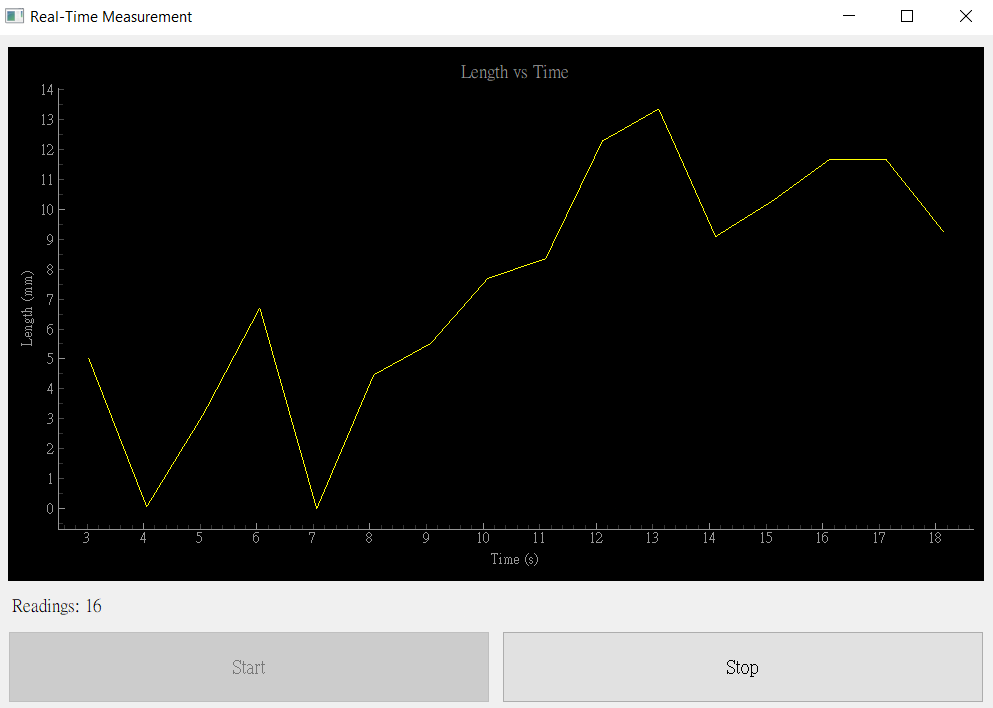

# Mitutoyo Reader
A minimal Python application for automated readings from Mitutoyo devices, with a live graphical interface and CSV logging.  
Built on [pytuyo](https://github.com/rabryan/pytuyo) for USB communication.




## Features
- Real-time measurement graph using **PyQtGraph**
- Automatic CSV logging
- Start/Stop UI buttons
- Total readings counter
- Cross-platform (Windows & Linux) with minor tweaks

## Requirements
- **Windows users must set up USB drivers via Zadig (see [below](#windows-zadig-setup))**
- Mitutoyo USB-ITN cable

## Usage

1. Connect the Mitutoyo device
2. Setup Zadig driver (windows) (see [here](#windows-zadig-setup))
3. Run the application:
    ```bash
    run.exe
    ```
4. **Set the update interval** in seconds
5. Press **Start** to begin capturing readings
6. CSV files are saved in the `data/` folder:
   ```
   Mitutoyo_Measurements_YYYYMMDD_HHMMSS.csv
   ```
>  **Note:** The app will create a `data/` folder if it doesnt locate one.

### Example CSV Output
| timestamp                  | value_mm |
|----------------------------|----------|
| 2025-08-15 10:34:12.123456 | 12.345   |
| 2025-08-15 10:34:13.123456 | 3.142    |

## Windows Zadig Setup

1. Download [Zadig](https://zadig.akeo.ie/)
2. Go to **Options > List All Devices**
3. Select **USB-ITN** from the dropdown
4. Set **Target Driver** to `libusb0`
5. Click **Replace Driver**
6. Done

> **Note:** After this, the DATA button on the Mitutoyo device will no longer work. But you can probably write a manual read script to compensate.
> You can also revert to the original HID driver (see [below](#reverting-to-original-hid-driver-windows-10)).

## Reverting to Original HID Driver (Windows 10)

1. **Win + X** → **Device Manager**
2. Expand **libusb-win32 devices** → **USB-ITN**
3. Right-click → **Update Driver**
4. **Browse my computer for drivers** → **Let me pick from a list of available drivers**
5. Select **USB Input Device**
6. Done

## Notes
- Linux users may need to set permission for non-root USB access:
- CSV filenames auto-increment if a duplicate timestamp is detected.
- Only tested on the Mitutoyo 543-701B

## Installation (For Development)

1. **Clone the repository**
   ```bash
   git clone https://github.com/yourusername/mitutoyo-reader.git
   cd mitutoyo-reader
   ```

2. **Install dependencies**
   ```bash
   pip install -r requirements.txt
   ```

3. **Connect your device**
   - Plug in your Mitutoyo device via USB-ITN cable
   - On Linux: you may need a `udev` rule for non-root access (see Notes)
   - On Windows: complete the Zadig setup below

## License
This project is licensed under the MIT License — see [LICENSE](LICENSE) for details.  
Portions of USB communication logic are from [pytuyo](https://github.com/rabryan/pytuyo) (MIT license).

## Acknowledgements
- [pytuyo](https://github.com/rabryan/pytuyo) – Mitutoyo USB communication
- [PyQtGraph](http://www.pyqtgraph.org/) – Fast interactive plotting
- [Zadig](https://zadig.akeo.ie/) – USB driver installation on Windows

This project is an independent, open-source tool and is **not** affiliated with, endorsed by, or connected to Mitutoyo Corporation.  
All product names, trademarks, and registered trademarks are property of their respective owners.